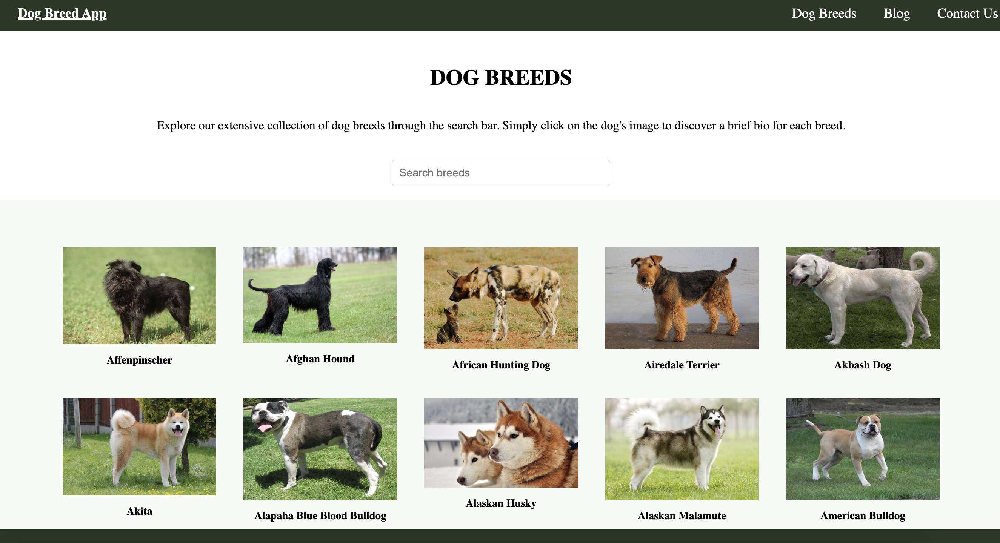
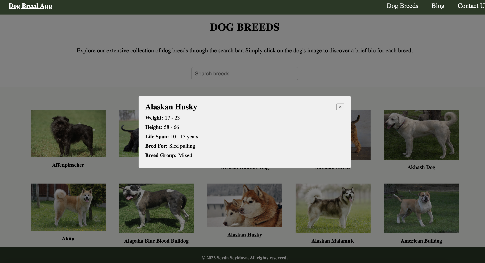

# DogBreedsapp
App that allows users to explore a wide variety of dog breeds.

## Links

Deployed at: 

## Description 

The Dog Breed Explorer is an Angular application that allows users to explore a wide variety of dog breeds. Powered by the DogAPi, it provides access to a vast collection of dog breed information.

Key features:

- Browse and search through an extensive collection of dog breeds.
- Click on a dog's image to access a brief bio and key details about each breed.
- Enjoy a visually appealing design that enhances the browsing experience.
- The Dog Breed App leverages the DogAPI, which serves as a reliable source of up-to-date and comprehensive dog breed data. From breed characteristics to images, the app offers a rich and informative experience for dog enthusiasts and those seeking to learn more about different breeds.

## Table of Contents (Optional)

* [Installation]
* [Usage]
* [License]

## Installation

1. Clone the repository to your local machine.
2. Install the required dependencies using npm install.
3. Start the app using ng serve.
4. Open your browser and navigate to http://localhost:3000

## Usage 

- Screeshot of the Web Page:

## Future Directions 

- User Authentication: Implement user authentication and authorization features to allow users to create accounts, save their favorite breeds, and personalize their experience.
- Mobile Application: Develop a mobile version of the app for iOS and Android devices, providing a seamless user experience on smartphones and tablets.
- Advanced Search Options: Enhance the search functionality by adding advanced filtering options such as size, temperament, activity level, or specific breed characteristics.
- User Reviews and Ratings: Allow users to provide reviews and ratings for different dog breeds, providing valuable insights for other users who are researching breeds.

## License

Please refer to the LICENSE in the repo.